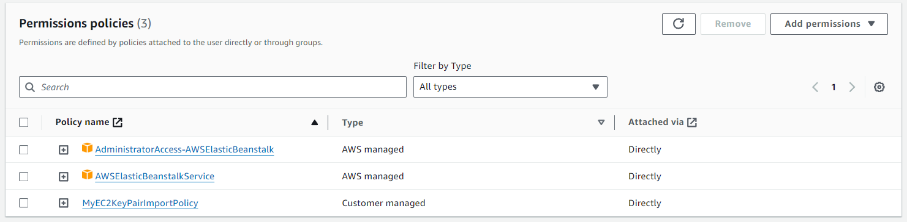

# Развертывание Node.js приложения на Amazon Elastic Beanstalk

## Регистрация и настройка прав пользователя. Получение ключей

Чтобы успешно развернуть и управлять приложениями в AWS Elastic Beanstalk, необходимо правильно настроить права пользователя и получить ключи доступа. Вот как вы можете это сделать:

### Шаг 1: Регистрация в AWS

Если у вас еще нет аккаунта AWS, первым шагом будет его создание. Перейдите на [официальный сайт AWS](https://aws.amazon.com/) и следуйте инструкциям для регистрации нового аккаунта.

### Шаг 2: Создание нового пользователя в IAM

1. Войдите в консоль управления AWS и перейдите в сервис **IAM (Identity and Access Management)**.
2. В панели навигации выберите **Пользователи** и нажмите **Добавить пользователя**.
3. Введите имя пользователя и выберите тип доступа **Программный доступ**. Это позволит использовать ключи доступа AWS для работы с AWS CLI и SDK.
4. На шаге разрешений выберите **Присоединение существующих политик напрямую** и найдите политику **AWSElasticBeanstalkFullAccess** (или другую, соответствующую вашим требованиям безопасности и доступа).
5. Продолжите следовать инструкциям, чтобы завершить создание пользователя.

### Шаг 3: Получение ключей доступа

После создания пользователя вам будут предоставлены **ID ключа доступа** (AWS Access Key ID) и **Секретный ключ доступа** (AWS Secret Access Key). Эти ключи необходимы для работы с AWS CLI и SDK.

- **Важно**: Сохраните эти ключи в надежном месте. Секретный ключ доступа показывается только один раз при создании и не может быть восстановлен в будущем. Если вы потеряете секретный ключ, вам придется создать новый.

### Шаг 4: Настройка AWS CLI

1. Если AWS CLI еще не установлен, следуйте инструкциям по его установке.
2. Откройте терминал и выполните команду `aws configure`.
3. Введите полученный **ID ключа доступа** и **Секретный ключ доступа**.
4. Укажите регион по умолчанию (например, `us-west-2`) и формат вывода (например, `json`).

### Шаг 5. Настройка прав




## Подготовка и настройка среды

### Введение в AWS и Elastic Beanstalk

#### Обзор AWS и зачем нужен Elastic Beanstalk

##### Обзор AWS

Amazon Web Services (AWS) является одним из ведущих облачных провайдеров, предлагающих широкий спектр вычислительных ресурсов, хранилища, баз данных и множество других сервисов, которые помогают организациям масштабироваться и расти. AWS предоставляет надежную, масштабируемую и экономически эффективную инфраструктуру платформы, которая питает сотни тысяч бизнесов в 190 странах мира. С AWS разработчики могут легко развертывать и управлять приложениями в облаке, сокращая время на техническое обслуживание и фокусируясь на инновациях.

##### Зачем нужен Elastic Beanstalk

AWS Elastic Beanstalk – это сервис оркестрации для развертывания инфраструктуры, который автоматизирует процесс развертывания приложений в облаке AWS. Этот сервис позволяет разработчикам загружать свои приложения, после чего автоматически обрабатывает такие задачи, как развертывание, масштабирование и мониторинг.

Основные преимущества Elastic Beanstalk:

1. **Простота использования:** Elastic Beanstalk автоматически обрабатывает детали развертывания, от мониторинга до масштабирования и обеспечения безопасности, позволяя разработчикам сосредоточиться на коде своего приложения.
2. **Масштабируемость:** Сервис предоставляет легкость в масштабировании приложений, автоматически адаптируя ресурсы под изменяющуюся нагрузку.
3. **Быстрое развертывание:** Elastic Beanstalk позволяет быстро развертывать и обновлять приложения с минимальными настройками.
4. **Управление версиями и окружениями:** Поддерживает множество версий приложения и позволяет легко переключаться между разными версиями и окружениями.
5. **Интеграция с другими AWS сервисами:** Легко интегрируется с другими сервисами AWS, такими как Amazon RDS, Amazon S3, Amazon CloudWatch, для обеспечения комплексного управления ресурсами приложения.

##### Как работает Elastic Beanstalk

1. **Загрузка приложения:** Разработчики загружают свое приложение в Elastic Beanstalk, используя EB CLI или AWS Management Console.
2. **Автоматическое развертывание:** Elastic Beanstalk автоматически разворачивает приложение на инфраструктуре AWS, создавая необходимые ресурсы, такие как EC2 инстансы, базы данных, балансировщики нагрузки и т.д.
3. **Мониторинг и управление:** После развертывания Elastic Beanstalk предоставляет инструменты для мониторинга состояния приложения и его ресурсов, а также инструменты для масштабирования и обновления приложения.

#### Понимание основных понятий и компонентов Elastic Beanstalk

AWS Elastic Beanstalk предлагает обширный набор инструментов и сервисов для управления жизненным циклом веб-приложений и сервисов. Для эффективной работы с Elastic Beanstalk важно понимать его ключевые компоненты и понятия.

1. **Приложение (Application):** В контексте Elastic Beanstalk, приложение является основным контейнером, который включает в себя одно или несколько окружений (environments), версий приложения (application versions), и конфигураций окружений (environment configurations).
2. **Версия приложения (Application Version):** Версия приложения представляет собой специфичную итерацию кода приложения, которую вы загружаете в Elastic Beanstalk. Каждая версия ассоциируется с конкретным S3 объектом (ZIP архивом или WAR файлом), содержащим код приложения.
3. **Окружение (Environment):** Окружение Elastic Beanstalk – это версия приложения, развернутая на AWS инфраструктуре и настроенная для конкретного случая использования. Каждое окружение работает на отдельном экземпляре и может быть настроено независимо от других окружений в рамках одного приложения.
4. **Конфигурация окружения (Environment Configuration):** Конфигурация окружения включает в себя набор параметров и настроек, которые определяют, как окружение будет запущено и какие ресурсы AWS будут использоваться. Это включает в себя выбор типа экземпляра, настройки балансировщика нагрузки, переменные среды и многое другое.
5. **Платформа (Platform):** Платформа Elastic Beanstalk определяет стек технологий (например, Node.js, PHP, .NET), который будет использоваться для запуска приложения. AWS Elastic Beanstalk поддерживает множество платформ, каждая из которых предварительно настроена с оптимальными настройками для соответствующих технологий.
6. **Ресурсы (Resources):** Elastic Beanstalk автоматически создает и управляет набором AWS ресурсов, необходимых для запуска вашего приложения. Это включает в себя экземпляры Amazon EC2, базы данных Amazon RDS, балансировщики нагрузки Elastic Load Balancing и другие.
7. **Консоль управления Elastic Beanstalk (Elastic Beanstalk Management Console):** Графический интерфейс пользователя, предоставляемый AWS для управления Elastic Beanstalk приложениями. Через консоль можно создавать, конфигурировать и мониторить приложения и окружения.
8. **Elastic Beanstalk CLI (EB CLI):** Командная строка, предоставляемая AWS для управления Elastic Beanstalk приложениями. EB CLI предлагает быстрый и простой способ создания, обновления и мониторинга приложений и окружений непосредственно из командной строки.

### Установка и настройка AWS CLI

#### Установка `Python 3.8`

Для работы с AWS CLI необходимо установить Python, так как AWS CLI использует Python для своей работы. Рекомендуется использовать Python версии 3.8, поскольку он обеспечивает стабильность и совместимость с большинством инструментов. Вот шаги по установке Python 3.8 и настройке AWS CLI:

1. **Скачайте и установите Python 3.8:**

   - Перейдите на официальный сайт Python (<https://www.python.org/downloads/>) и скачайте установочный файл для Python 3.8.
   - Запустите установочный файл и следуйте инструкциям мастера установки. Убедитесь, что вы отметили опцию "Add Python 3.8 to PATH" во время установки. Это позволит вам запускать Python из командной строки.
2. **Проверьте установку Python:**

   - Откройте командную строку или терминал и введите команду:

     ```
     python --version
     ```

   - Вы должны увидеть версию Python, подтверждающую успешную установку, например:

     ```
     Python 3.8.x
     ```

#### Установка `pip`

`pip` — это стандартный менеджер пакетов для Python, который позволяет вам устанавливать и управлять дополнительными библиотеками и зависимостями, не входящими в стандартную библиотеку Python. Для работы с AWS CLI и Elastic Beanstalk CLI важно иметь установленный `pip`. В большинстве случаев `pip` устанавливается автоматически вместе с Python 3.4 и новее. Однако, если у вас его нет, его можно установить отдельно.

1. **Проверка установлен ли `pip`:**
   Откройте терминал или командную строку и выполните следующую команду:

   ```shell
   pip --version
   ```

   Если `pip` установлен, вы увидите версию установленного пакета. Если нет, следуйте инструкциям ниже для его установки.
2. **Установка `pip` для Windows:**

   - Скачайте [get-pip.py](https://bootstrap.pypa.io/get-pip.py) скрипт.
   - Откройте командную строку и перейдите в каталог, куда был скачан скрипт.
   - Запустите скрипт командой:

     ```shell
     python get-pip.py
     ```

3. **Установка `pip` для macOS и Linux:**

   - Обычно `pip` уже предустановлен в этих системах. Если это не так, используйте менеджер пакетов вашей системы для его установки.
   - Для macOS:

     ```shell
     sudo easy_install pip
     ```

   - Для большинства дистрибутивов Linux:

     ```shell
     sudo apt-get install python3-pip
     ```

     или для CentOS:

     ```shell
     sudo yum install python3-pip
     ```

После установки `pip`, вы можете использовать его для управления пакетами Python, включая установку AWS CLI и Elastic Beanstalk CLI.

#### Проверка переменной среды

Переменные среды используются операционной системой и приложениями для хранения настроек и конфигураций, необходимых для их правильной работы. Для работы с AWS CLI и Elastic Beanstalk CLI важно убедиться, что путь к Python и `pip` правильно настроен в переменных среды вашей системы. Это обеспечит доступность этих инструментов из любого каталога в командной строке или терминале.

1. **Проверка переменной среды на Windows:**

   - Откройте командную строку (cmd) или PowerShell.
   - Введите следующую команду:

     ```shell
     echo %PATH%
     ```

   - Проверьте вывод на наличие путей к директориям Python и `pip`, обычно это `C:\Python38\Scripts\` и `C:\Python38\`, если вы установили Python 3.8 в стандартное место. Если эти пути отсутствуют, вам нужно добавить их в переменную среды PATH.
2. **Добавление путей к Python и `pip` в переменную среды PATH на Windows:**

   - Откройте "Система" через Панель управления или Поиск.
   - Перейдите в "Дополнительные системные настройки" -> "Переменные среды".
   - Найдите переменную среды PATH в списке "Системные переменные" и выберите "Изменить".
   - Добавьте путь к директории Python и `pip` в конец строки, разделяя пути символом ";". Например, `;C:\Python38\;C:\Python38\Scripts\`.
   - Нажмите "OK" для сохранения изменений.
3. **Проверка переменной среды на macOS и Linux:**

   - Откройте терминал.
   - Введите следующую команду:

     ```shell
     echo $PATH
     ```

   - Проверьте вывод на наличие путей к директориям Python и `pip`. Если вы использовали установку по умолчанию, Python обычно будет доступен в PATH. Если нет, вам может потребоваться добавить его вручную, используя файл конфигурации вашего shell, например `.bash_profile` или `.zshrc`.

Убедившись, что переменные среды настроены правильно, вы обеспечите беспрепятственную работу с AWS CLI и другими инструментами Python из командной строки или терминала.

#### Установка AWS CLI из GitHub репозитория [aws-elastic-beanstalk-cli](aws-elastic-beanstalk-cli)

Для установки AWS CLI из репозитория `aws-elastic-beanstalk-cli` на GitHub, следуйте данным инструкциям.

1. **Клонирование репозитория:**
   Откройте терминал и выполните следующую команду для клонирования репозитория на ваш локальный компьютер. Замените `<репозиторий>` на актуальный путь к репозиторию, если он доступен.

   ```shell
   git clone https://github.com/<репозиторий>.git
   ```

   Пример:

   ```shell
   git clone https://github.com/aws/aws-elastic-beanstalk-cli-setup.git
   ```

2. **Переход в каталог репозитория:**
   После клонирования перейдите в каталог с репозиторием.

   ```shell
   cd aws-elastic-beanstalk-cli-setup
   ```

3. **Установка:**
   Внутри каталога репозитория может быть предоставлен скрипт или инструкции для установки. Если речь идет о CLI для Elastic Beanstalk, скорее всего, будет предоставлен скрипт установки. Выполните его согласно инструкции. Например:

   ```shell
   ./scripts/ebcli_installer.py
   ```

4. **Проверка установки:**
   После завершения установки проверьте, успешно ли был установлен AWS CLI, выполнив:

   ```shell
   eb --version
   ```

   Это должно вывести версию установленного Elastic Beanstalk CLI.

#### Проверка версии после установки

После установки AWS CLI и Elastic Beanstalk CLI важно убедиться, что установка прошла успешно и вы используете ожидаемую версию инструментов. Вот как вы можете проверить версии установленных инструментов:

1. **Проверка версии AWS CLI:**
   Для проверки версии AWS CLI откройте терминал или командную строку и введите следующую команду:

   ```shell
   aws --version
   ```

   В ответ команда должна вывести версию установленного AWS CLI, например:

   ```
   aws-cli/2.1.29 Python/3.8.8 Windows/10 botocore/2.0.0dev34
   ```

   Это подтверждает, что AWS CLI установлен и доступен для использования.
2. **Проверка версии Elastic Beanstalk CLI:**
   Аналогично, чтобы проверить версию Elastic Beanstalk CLI, используйте следующую команду:

   ```shell
   eb --version
   ```

   Команда вернет версию Elastic Beanstalk CLI, например:

   ```
   EB CLI 3.19.2 (Python 3.8.1)
   ```

   Это указывает на то, что Elastic Beanstalk CLI успешно установлен и готов к использованию.

Проверка версий установленных инструментов помогает убедиться в их правильной работе и совместимости с вашими проектами. В случае, если версии не соответствуют ожидаемым, рекомендуется обновить инструменты до последних версий, следуя официальной документации.

#### Настройка AWS CLI с использованием `aws configure`

После успешной установки AWS CLI его необходимо настроить для работы с вашим AWS аккаунтом. Это включает в себя указание учетных данных доступа, региона по умолчанию и формата вывода. Для этого используется команда `aws configure`.

1. **Запуск настройки:**
   Откройте терминал или командную строку и введите следующую команду:

   ```shell
   aws configure
   ```

   После этого вам будет предложено ввести несколько настроек.
2. **Ввод учетных данных доступа:**

   - `AWS Access Key ID [None]:` Введите ваш `Access Key ID`. Учетные данные можно получить в IAM (Identity and Access Management) на AWS Management Console.
   - `AWS Secret Access Key [None]:` Введите ваш `Secret Access Key`. Эти учетные данные также предоставляются в IAM при создании нового пользователя или группы пользователей.
3. **Выбор региона по умолчанию:**

   - `Default region name [None]:` Введите код региона, в котором вы хотите работать по умолчанию. Например, `us-west-2` для Орегона или `eu-central-1` для Франкфурта. Список доступных регионов можно найти в документации AWS.
4. **Установка формата вывода:**

   - `Default output format [None]:` Вы можете выбрать формат вывода данных команд AWS CLI. Доступные форматы: `json`, `yaml`, `yaml-stream`, `text`, `table`. JSON является форматом по умолчанию.

После завершения настройки `aws configure` создает файл конфигурации (`~/.aws/config`) и файл учетных данных (`~/.aws/credentials`) в вашем домашнем каталоге. Эти файлы используются AWS CLI для аутентификации и хранения настроек.

## Настройка приложения на Elastic Beanstalk

### Работа с Elastic Beanstalk

#### Инициализация приложения с помощью EB CLI

Инициализация приложения в Elastic Beanstalk с использованием EB CLI является первым шагом к управлению вашими приложениями и окружениями из командной строки. Вот как вы можете инициализировать новое приложение или настроить существующее с EB CLI:

1. **Открытие терминала:**
   Начните с открытия терминала на вашем компьютере и перехода в каталог проекта, который вы хотите развернуть на Elastic Beanstalk.
2. **Использование команды `eb init`:**
   Введите команду `eb init` для начала процесса инициализации. EB CLI задаст вам ряд вопросов для настройки вашего приложения и окружения.

   ```shell
   eb init
   ```

3. **Выбор региона:**
   Вам будет предложено выбрать регион AWS, в котором будет развернуто ваше приложение. Выберите регион, ближайший к вашим пользователям, для минимизации задержек.
4. **Настройка учетных данных AWS:**
   Если вы еще не настроили учетные данные AWS с помощью `aws configure`, EB CLI предложит вам это сделать. Введите ваш `AWS Access Key ID` и `AWS Secret Access Key`.
5. **Выбор приложения:**
   Если у вас уже есть приложения в Elastic Beanstalk, вы можете выбрать одно из них для настройки. В противном случае EB CLI предложит создать новое приложение.
6. **Конфигурация платформы:**
   Выберите платформу, которая соответствует технологии вашего приложения (например, Node.js, Python, Java и т.д.). EB CLI также позволяет выбрать версию платформы.
7. **Настройка SSH доступа (необязательно):**
   EB CLI может настроить для вас SSH доступ к экземплярам EC2, используемым в вашем Elastic Beanstalk окружении. Вам будет предложено создать новую пару ключей SSH или использовать существующую.

После завершения инициализации, EB CLI создаст файл `.elasticbeanstalk/config.yml` в вашем проекте, который содержит настройки вашего приложения и окружения.

Инициализация приложения с EB CLI упрощает управление приложениями Elastic Beanstalk, позволяя вам быстро настраивать и развертывать ваше приложение прямо из командной строки.

#### Создание окружения и развертывание приложения

После инициализации приложения с помощью EB CLI следующим шагом является создание окружения Elastic Beanstalk и развертывание вашего приложения. Вот как можно это сделать:

1. **Создание нового окружения:**
   Используйте команду `eb create` для создания нового окружения в вашем приложении Elastic Beanstalk. Вам будет предложено ввести имя окружения и другие необходимые параметры.

   ```shell
   eb create my-env-name
   ```

   Замените `my-env-name` на желаемое имя для вашего окружения. EB CLI автоматически начнет процесс создания окружения и развертывания вашего приложения.
2. **Конфигурация параметров окружения (необязательно):**
   Если вам нужно настроить специфические параметры окружения, такие как размер инстанса EC2 или конфигурацию базы данных, вы можете сделать это во время создания окружения или после его создания, используя команду `eb config`.
3. **Мониторинг процесса создания:**
   EB CLI предоставляет обновления статуса в реальном времени во время создания окружения и развертывания приложения. Вы можете отслеживать прогресс и убедиться, что все проходит успешно.
4. **Открытие приложения в браузере:**
   После успешного развертывания приложения и создания окружения, вы можете открыть ваше приложение в браузере, используя команду `eb open`.

   ```shell
   eb open
   ```

   Эта команда автоматически откроет URL вашего приложения в браузере по умолчанию.
5. **Обновление и повторное развертывание приложения:**
   В будущем, когда вы внесете изменения в ваше приложение, вы можете быстро развернуть новую версию, используя команду `eb deploy`.

   ```shell
   eb deploy
   ```

Эти шаги позволяют легко создать окружение для вашего приложения и развернуть его на Elastic Beanstalk, используя мощные инструменты командной строки EB CLI. Elastic Beanstalk автоматически обрабатывает детали развертывания, включая настройку инфраструктуры, балансировку нагрузки, масштабирование и мониторинг.

#### Изменение кода и повторный деплоинг

После того как ваше приложение успешно развернуто в Elastic Beanstalk, вы можете вносить в него изменения и быстро обновлять версию приложения в окружении. Вот как можно изменить код и выполнить повторный деплой:

1. **Внесение изменений в код:**
   Откройте код вашего приложения в любом текстовом редакторе или интегрированной среде разработки (IDE) и внесите необходимые изменения. Это могут быть исправления ошибок, добавление новых функций или любые другие обновления, которые вы хотите внедрить.
2. **Тестирование изменений локально:**
   Перед повторным развертыванием важно протестировать изменения локально, чтобы убедиться, что новая версия работает корректно и не содержит критических ошибок.
3. **Выполнение коммита изменений:**
   Если вы используете систему контроля версий, такую как Git, выполните коммит измененных файлов в ваш репозиторий. Это позволит сохранить историю изменений и облегчить откат к предыдущим версиям при необходимости.

   ```shell
   git add .
   git commit -m "Описание внесенных изменений"
   ```

4. **Повторное развертывание приложения:**
   Используйте команду `eb deploy` для запуска процесса повторного развертывания приложения в Elastic Beanstalk. EB CLI автоматически создаст новую версию приложения и развернет ее в вашем окружении.

   ```shell
   eb deploy
   ```

   Во время развертывания Elastic Beanstalk обновит окружение новой версией вашего приложения, не прерывая его работу и обеспечивая минимальное время простоя.
5. **Мониторинг статуса развертывания:**
   После запуска команды `eb deploy` вы можете отслеживать процесс развертывания в консоли Elastic Beanstalk или используя команду `eb events`, которая показывает последние события в вашем окружении.

   ```shell
   eb events -f
   ```

6. **Проверка работы приложения:**
   После успешного развертывания откройте приложение в браузере, чтобы убедиться, что все изменения работают как ожидалось. Используйте команду `eb open` для быстрого доступа к вашему приложению.

   ```shell
   eb open
   ```

Повторное развертывание приложения с изменениями — это простой процесс, который помогает обновлять и улучшать ваше приложение, обеспечивая его актуальность и стабильность работы.

### Мониторинг и логирование

#### Использование EB CLI для мониторинга состояния приложения

Мониторинг состояния вашего приложения является важной частью поддержки его стабильной и эффективной работы. AWS Elastic Beanstalk предоставляет инструменты для мониторинга и логирования, которые можно удобно использовать через Elastic Beanstalk Command Line Interface (EB CLI). Вот как вы можете использовать EB CLI для мониторинга состояния вашего приложения:

1. **Просмотр событий окружения:**
   Команда `eb events` позволяет просмотреть последние события в вашем окружении. Это может включать информацию о процессах развертывания, изменениях состояния и возможных ошибках.

   ```shell
   eb events
   ```

   Для непрерывного отслеживания событий в реальном времени используйте флаг `-f`.

   ```shell
   eb events -f
   ```

2. **Проверка состояния здоровья окружения:**
   Команда `eb health` отображает подробную информацию о состоянии здоровья вашего окружения, включая состояние каждого экземпляра и метрики здоровья, такие как процент успешных запросов и время отклика.

   ```shell
   eb health
   ```

   Вы можете настроить вывод, используя различные опции, для получения более детальной информации.
3. **Получение логов:**
   EB CLI упрощает процесс сбора и просмотра логов с вашего окружения и его экземпляров. Используйте команду `eb logs` для получения логов.

   ```shell
   eb logs
   ```

   Вы можете указать, хотите ли вы получить логи с определенного экземпляра или собрать логи со всех экземпляров.
4. **Мониторинг производительности приложения:**
   Для более глубокого анализа производительности приложения вы можете использовать интеграцию Elastic Beanstalk с Amazon CloudWatch. Это позволяет отслеживать метрики, такие как загрузка CPU, использование памяти, входящий трафик и многое другое.

   Хотя для доступа к метрикам CloudWatch обычно используется AWS Management Console, вы также можете настроить оповещения и дашборды для мониторинга ключевых показателей вашего приложения.

Использование этих инструментов мониторинга и логирования через EB CLI позволяет быстро реагировать на изменения в работе приложения, определять и устранять возникающие проблемы, а также оптимизировать производительность приложения.

## Материалы и ресурсы

### Официальная документация AWS Elastic Beanstalk

Официальная документация AWS Elastic Beanstalk предоставляет полный обзор сервиса, включая инструкции по настройке, управлению и мониторингу ваших приложений. Это первичный ресурс для получения надежной информации о функциях Elastic Beanstalk и лучших практиках использования.

- [AWS Elastic Beanstalk Documentation](https://docs.aws.amazon.com/elasticbeanstalk/latest/dg/)

### Руководства и примеры кода для Node.js приложений на Elastic Beanstalk

AWS предлагает различные руководства и примеры кода, которые могут помочь вам быстро начать работу с Node.js приложениями на Elastic Beanstalk. Эти ресурсы включают пошаговые инструкции и образцы кода, демонстрирующие наиболее распространенные сценарии использования.

- [Deploying Node.js Applications on AWS Elastic Beanstalk](https://docs.aws.amazon.com/elasticbeanstalk/latest/dg/create_deploy_nodejs.html)

### Репозиторий AWS Elastic Beanstalk

- [aws-elastic-beanstalk-cli](https://github.com/aws/aws-elastic-beanstalk-cli)

### Список полезных команд EB CLI для быстрой справки

EB CLI (Elastic Beanstalk Command Line Interface) является мощным инструментом для управления вашими Elastic Beanstalk приложениями прямо из командной строки. Вот краткий список полезных команд, которые помогут вам управлять вашими приложениями более эффективно:

- `eb init` - инициализирует ваше приложение и создает новое окружение Elastic Beanstalk.
- `eb create` - создает новое окружение для вашего приложения.
- `eb deploy` - развертывает ваше приложение в указанном окружении.
- `eb status` - показывает статус текущего окружения.
- `eb open` - открывает ваше приложение в веб-браузере.
- `eb logs` - получает логи вашего приложения и окружения.
- `eb setenv` - устанавливает переменные окружения для вашего приложения.
- `eb terminate` - удаляет окружение и освобождает все связанные ресурсы.
